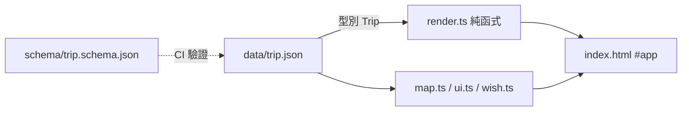

# 🏮 平溪 × 深坑 親子自駕行程

> 一個**資料驅動、離線可用**的互動式旅遊行程網站 —— 用一份 `trip.json` 驅動整個介面（時間軸、互動地圖、美食、打包清單、天燈許願牆）。

[](https://github.com/babykaty0412-debug/travel/actions/workflows/ci.yml)


**🔗 Live demo：** https://babykaty0412-debug.github.io/travel/

---

## ✨ 亮點功能

| | |
|---|---|
| 🗺️ **互動地圖** | Leaflet 標記依日別上色、沿**實際道路的路線**（OSRM，失敗自動退回直線）、**地圖磚跟著深淺色主題切換** |
| 🌗 **主題切換** | View Transitions API **圓形擴散過場**，偏好記憶於 localStorage |
| 🏮 **天燈許願牆** | 寫願望→天燈升空動畫；提示詞可**複選 / 🎲 隨機**、單盞刪除、一鍵清空、離線保存 |
| 🎒 **打包清單** | 可勾選、自動記住、全部完成放煙火慶祝 |
| ⏳ **出發倒數** | 依日期自動顯示「出發前 / 旅程中 Day N / 已結束」 |
| 📴 **PWA 離線** | Service Worker 快取，山區沒訊號也能看；可加入主畫面 |
| ♿ **無障礙 / 動效尊重** | `aria-current`、鍵盤 focus、`prefers-reduced-motion` |

---

## 🧱 技術棧

- **TypeScript（strict）** + **Vite 5** — 型別安全、現代打包
- **Leaflet** — 互動地圖（唯一 runtime 依賴，已 bundle，無 CDN）
- **原生 Web API** — View Transitions、IntersectionObserver、Service Worker、localStorage
- **零框架** — 純 TS 模組化，證明不靠 React 也能做到完整體驗

## 🏛️ 架構：資料驅動（單一真相來源）



改行程只動 **`public/data/trip.json`** 一個檔，畫面與地圖一起更新；換一趟旅程換一份 JSON 即可重用整套介面。

```
src/
├─ types.ts     # Trip 型別（trip.json 的合約）
├─ render.ts    # 由資料產生 HTML（純函式）
├─ map.ts       # Leaflet 地圖 + OSRM 路線 + 主題連動圖磚
├─ theme.ts     # View Transitions 主題切換
├─ ui.ts        # 倒數 / 導覽高亮 / 回頂端 / 捲動揭示 / 打包
├─ wish.ts      # 天燈許願牆
├─ fx.ts        # toast / 煙火 / 天燈動畫（共用）
├─ util.ts      # DOM / 儲存 / escape 工具
└─ main.ts      # 進入點（載入資料→渲染→各模組獨立初始化）
```

> 設計原則：每個模組**獨立初始化並被 `safe()` 包住** —— 例如地圖圖磚載不到，其餘功能照常運作。

---

## 🛠️ 工程實踐

- **CI（GitHub Actions）**：`tsc --strict` → ESLint → Prettier → **JSON Schema 驗資料** → Vite build → **Playwright E2E**，全綠才算過
- **E2E 測試**：6 條涵蓋渲染、倒數、主題、許願、打包、複選
- **型別安全**：`trip.json` 有 TS 型別 + JSON Schema 雙重把關，改資料打錯 CI 會擋
- **效能**：production bundle 約 **JS 50 KB / CSS 10 KB（gzip）**
- **PWA / 離線**：network-first 網頁 + cache-first 資源

## 💻 本機開發

```bash
npm install
npm run dev            # 開發伺服器
npm run build          # 產出 dist/
npm run preview        # 預覽 build 結果
npm run typecheck      # tsc --noEmit
npm run lint           # ESLint
npm run validate:data  # JSON Schema 驗 trip.json
npm test               # Playwright E2E（需先 build）
```

---

## 🧭 設計決策與取捨（Case study）

1. **從 Artifact 到真網站**：最初做成單檔 HTML，但其安全沙盒（CSP）**擋外部套件與地圖**。要用真實互動地圖 → 改用 **GitHub Pages** 靜態站。
2. **從 vanilla 到 TS + Vite**：能動的單檔 700 行難維護、資料寫死重複。重構成**資料驅動 + 模組化 + 型別安全**，改一處到處更新、可重複使用。
3. **零框架的取捨**：這個規模導入 React 反而增加複雜度；用原生 API 完成 View Transitions、離線、動效，**更輕、更快、也更能展現基本功**。
4. **炫技也要有 fallback**：OSRM 路線失敗退回直線、地圖失敗不影響全站、不支援 View Transitions 就直接切換 —— 漸進增強而非硬相依。

## 🚀 部署

- **v2（本專案 · Vite/TS）**：CI 於 `main` 分支自動 build 並部署到 Pages。
  啟用方式：GitHub **Settings → Pages → Source 選「GitHub Actions」**，再把分支合併進 `main`。
- **v1（`docs/` · 免建置 vanilla 版）**：目前線上版本，`Deploy from a branch → /docs`，保留作為對照與備援。

## 📄 授權

MIT
